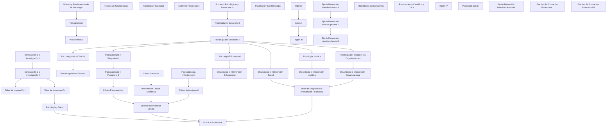

```mermaid
graph TD
  PSY101["Historia y Fundamentos de la Psicología"]
  PSY102["Tópicos de Neurobiología"]
  PSY103["Psicología y Sociedad"]
  PSY104["Sistemas Psicológicos"]
  PSY105["Procesos Psicológicos y Neurociencia"]
  PSY106["Psicología y Epistemología"]
  ING101["Inglés I"]
  GEN101["Eje de Formación Interdisciplinaria I"]
  PSY201["Psicoanálisis I"]
  PSY202["Psicología del Desarrollo I"]
  ING102["Inglés II"]
  GEN102["Habilidades Comunicativas"]
  GEN103["Eje de Formación Interdisciplinaria II"]
  PSY301["Psicoanálisis II"]
  PSY302["Psicología del Desarrollo II"]
  PSY303["Introducción a la Investigación I"]
  ING103["Inglés III"]
  GEN104["Razonamiento Científico y TICs"]
  PSY401["Psicodiagnóstico Clínico I"]
  PSY402["Psicopatología y Psiquiatría I"]
  PSY403["Introducción a la Investigación II"]
  ING104["Inglés IV"]
  GEN105["Eje de Formación Interdisciplinaria III"]
  PSY501["Psicodiagnóstico Clínico II"]
  PSY502["Psicopatología y Psiquiatría II"]
  PSY503["Taller de Integración I"]
  PSY504["Psicología Social"]
  GEN106["Eje de Formación Interdisciplinaria IV"]
  PSY601["Clínica Sistémica"]
  PSY602["Psicopatología Infantojuvenil"]
  PSY603["Psicología Educacional"]
  PSY604["Diagnóstico e Intervención Social"]
  PSY605["Psicología Jurídica"]
  PSY606["Psicología del Trabajo y las Organizaciones"]
  PSY701["Diagnóstico e Intervención Educacional"]
  PSY702["Diagnóstico e Intervención Organizacional"]
  PSY703["Clínica Psicoanalítica"]
  PSY704["Clínica Infantojuvenil"]
  PSY801["Taller de Investigación"]
  PSY802["Diagnóstico e Intervención Jurídica"]
  PSY803["Intervención Clínica Sistémica"]
  ELEC801["Electivo de Formación Profesional I"]
  ELEC802["Electivo de Formación Profesional II"]
  PSY901["Taller de Intervención Clínica"]
  PSY902["Psicología y Salud"]
  PSY903["Taller de Diagnóstico o Intervención Psicosocial"]
  PSY1001["Práctica Profesional"]
  PSY101 --> PSY201
  PSY105 --> PSY202
  ING101 --> ING102
  GEN101 --> GEN103
  PSY201 --> PSY301
  PSY202 --> PSY302
  PSY303 --> PSY403
  ING102 --> ING103
  GEN103 --> GEN105
  PSY302 --> PSY401
  PSY302 --> PSY402
  PSY401 --> PSY501
  PSY402 --> PSY502
  PSY403 --> PSY503
  PSY302 --> PSY603
  PSY302 --> PSY604
  PSY302 --> PSY605
  PSY302 --> PSY606
  PSY603 --> PSY701
  PSY606 --> PSY702
  PSY502 --> PSY703
  PSY602 --> PSY704
  PSY403 --> PSY801
  PSY605 --> PSY802
  PSY601 --> PSY803
  PSY703 --> PSY901
  PSY704 --> PSY901
  PSY803 --> PSY901
  PSY801 --> PSY902
  PSY604 --> PSY903
  PSY702 --> PSY903
  PSY901 --> PSY1001
  PSY902 --> PSY1001
  PSY903 --> PSY1001
```